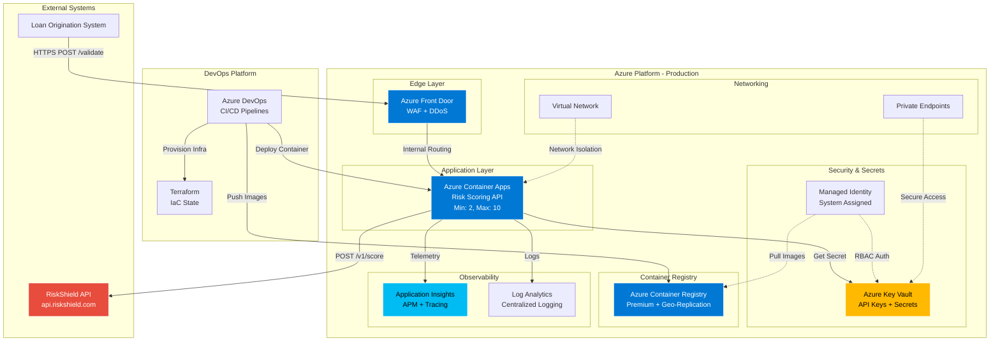
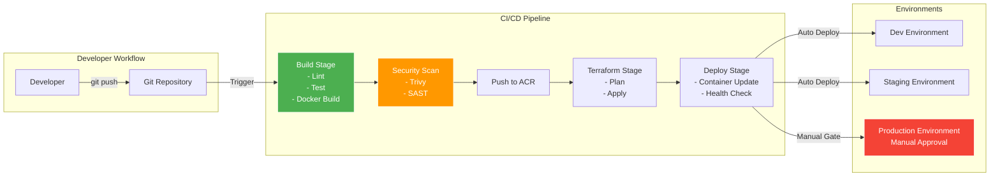
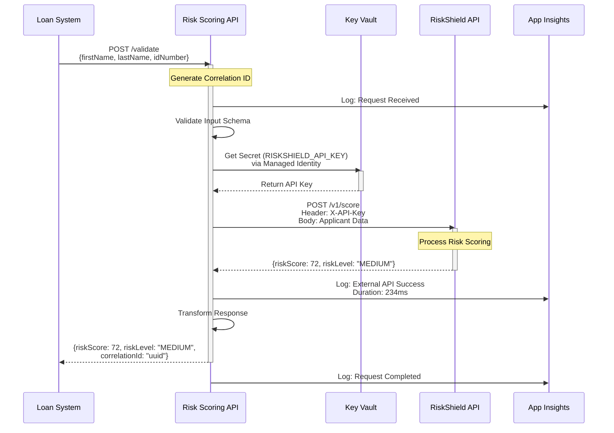
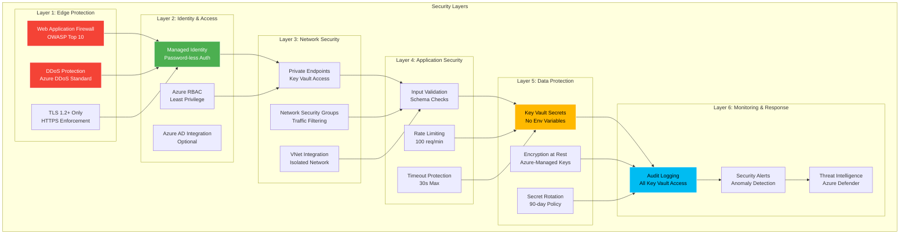
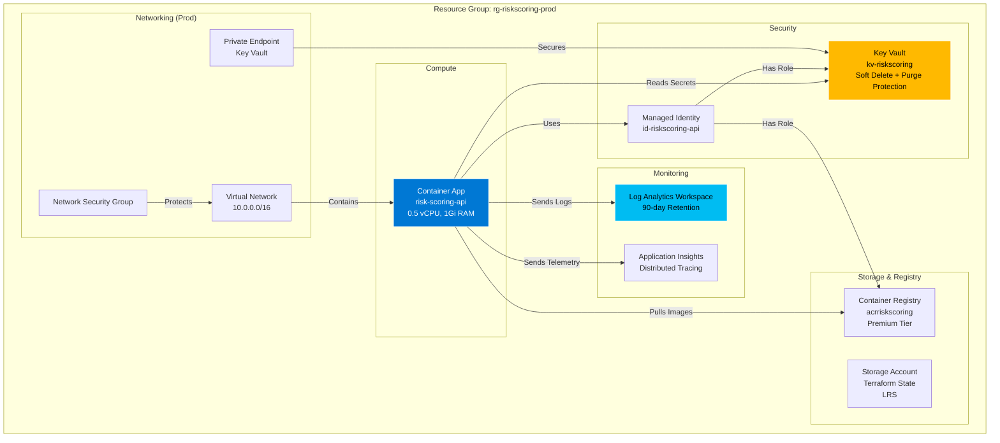
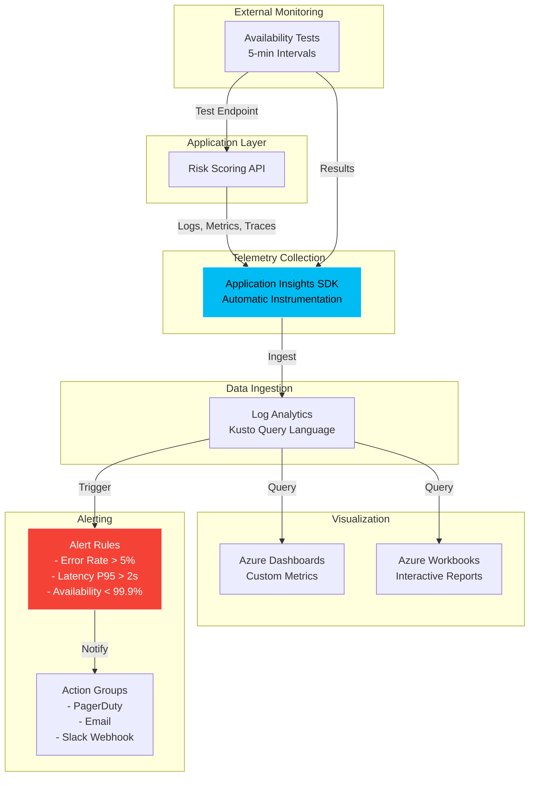
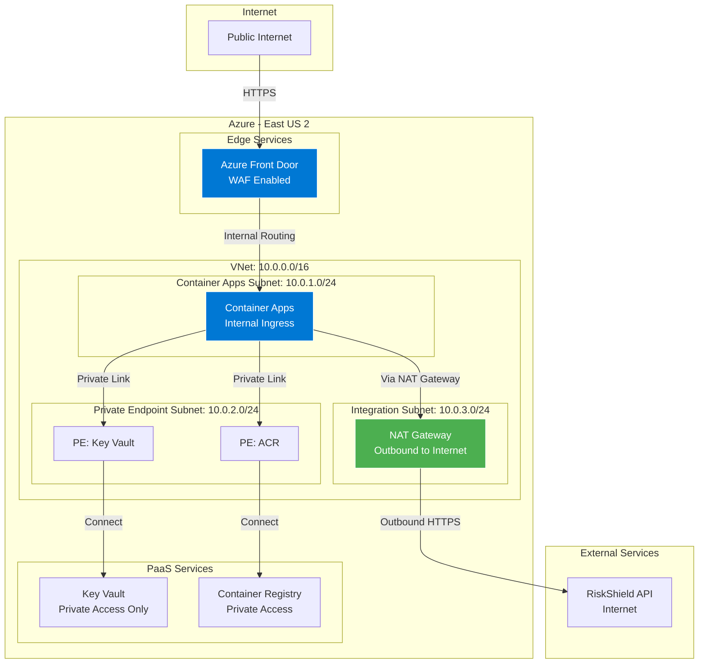
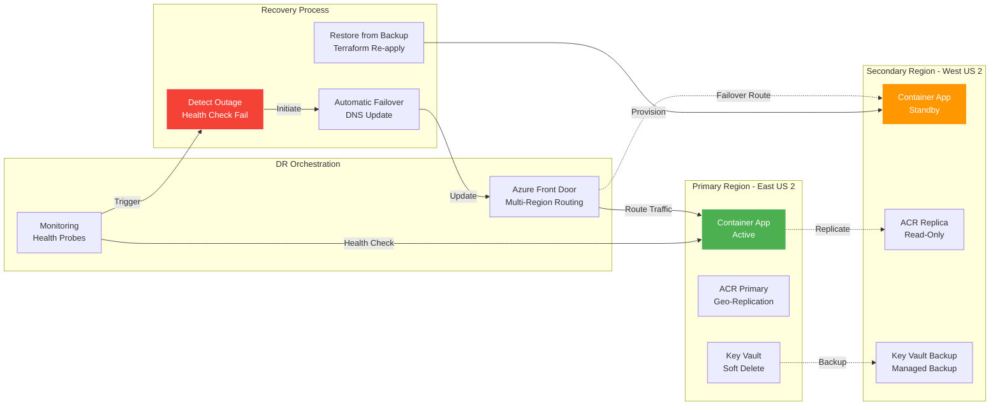

# Architecture Diagrams

## High-Level System Architecture

## Deployment Architecture

## Data Flow Diagram

## Security Architecture

## Infrastructure Components

## Observability Architecture

## Network Architecture - Production

## Disaster Recovery Flow

---

## Diagram Legend

### Color Coding
- **Blue (#0078d4)**: Azure Compute & Networking Services
- **Yellow (#ffb900)**: Security & Secrets
- **Cyan (#00bcf2)**: Monitoring & Observability
- **Green (#4caf50)**: Healthy/Active State
- **Orange (#ff9800)**: Warning/Standby State
- **Red (#f44336)**: Critical/Alert State
- **Purple (#e74c3c)**: External Services

### Icon Meanings
- **Solid Lines**: Active data flow
- **Dashed Lines**: Backup/replication flow
- **Arrows**: Direction of communication

---

*Last Updated: 2026-02-14*
