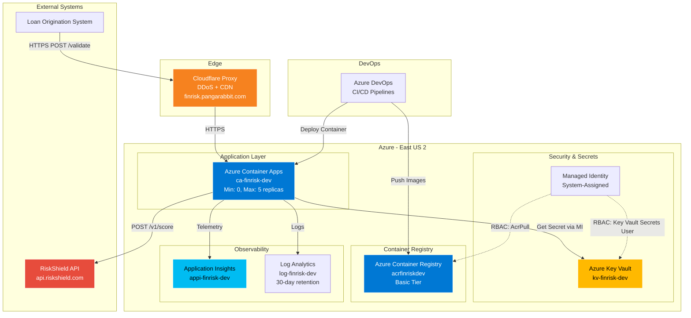
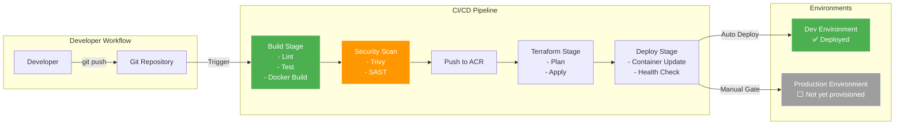
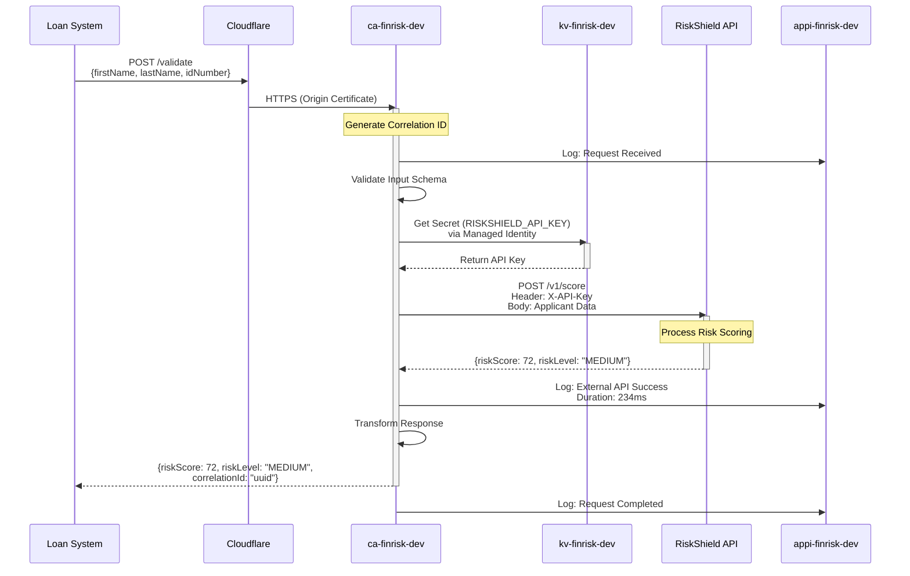
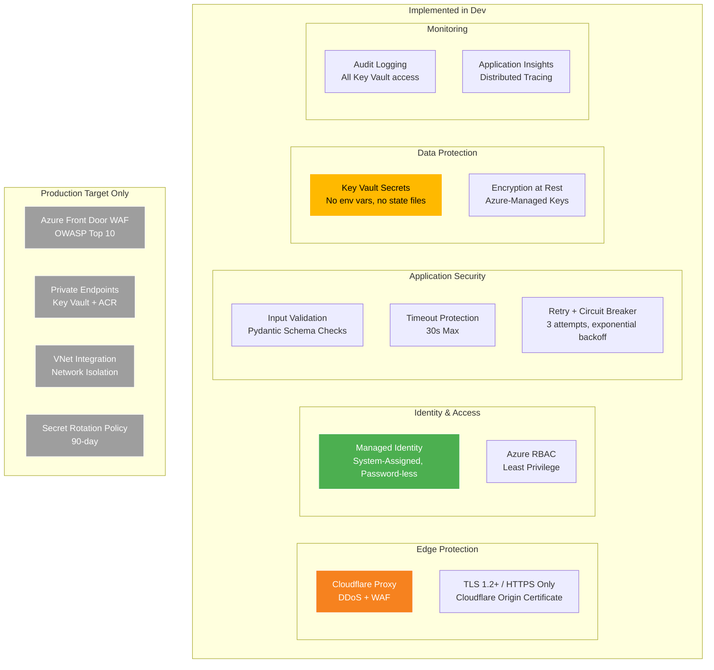
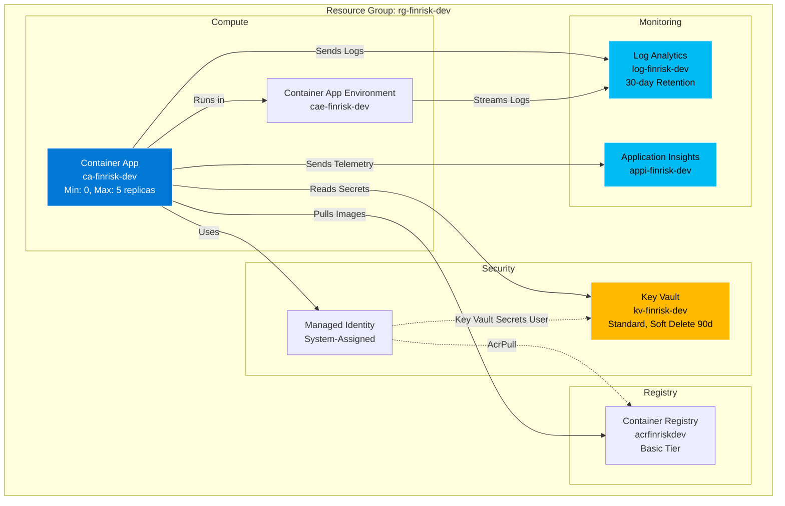
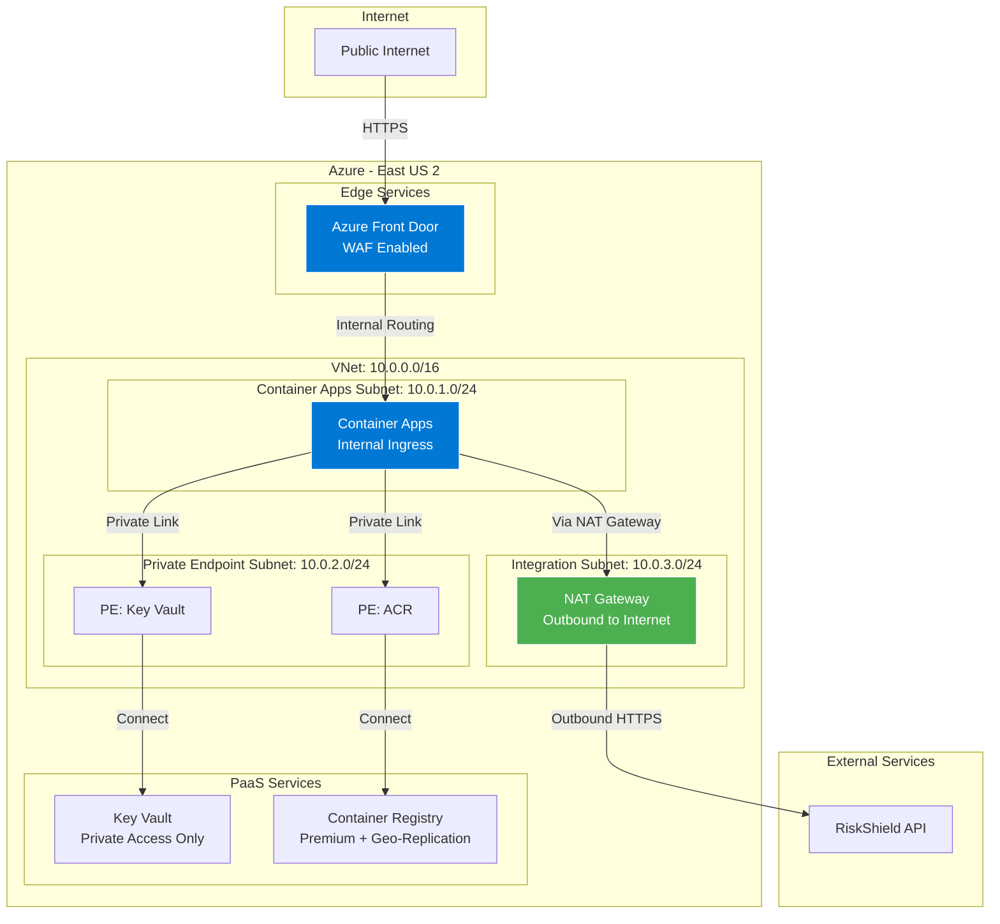
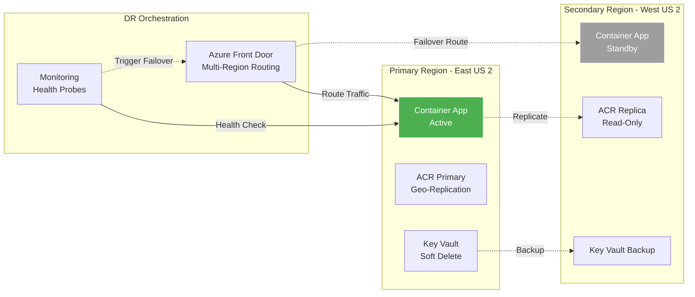

# Architecture Diagrams

> **Note on scope**: Diagrams marked **[DEPLOYED]** reflect the actual dev environment.
> Diagrams marked **[PRODUCTION TARGET]** describe the intended production architecture — not yet built.

---

## High-Level System Architecture [DEPLOYED]

Current deployed state: `dev` environment, East US 2. No Front Door — traffic enters via Cloudflare proxy to Container App direct ingress.

---

## Deployment Architecture [DEPLOYED]

Single environment (`dev`) deployed. Staging and production environments are not yet provisioned.

---

## Data Flow Diagram [DEPLOYED]

---

## Security Architecture [DEPLOYED vs TARGET]

---

## Infrastructure Components [DEPLOYED]

Actual deployed resources in `rg-finrisk-dev`, East US 2.

---

## Network Architecture [PRODUCTION TARGET]

Planned production topology. Not yet deployed.

---

## Disaster Recovery [PRODUCTION TARGET]

Planned multi-region topology. Not yet deployed.

---

## Diagram Legend

### Status Labels
- **[DEPLOYED]**: Reflects the actual `dev` environment as built
- **[PRODUCTION TARGET]**: Intended future architecture, not yet provisioned

### Color Coding
- **Blue (#0078d4)**: Azure Compute & Networking
- **Yellow (#ffb900)**: Security & Secrets
- **Cyan (#00bcf2)**: Monitoring & Observability
- **Orange (#f6821f)**: Cloudflare
- **Green (#4caf50)**: Healthy / Active
- **Grey (#9e9e9e)**: Not yet deployed
- **Red (#e74c3c)**: External Services

### Line Styles
- **Solid lines**: Active data flow
- **Dashed lines**: RBAC relationships / replication / failover paths

---

*Last Updated: 2026-02-17*
